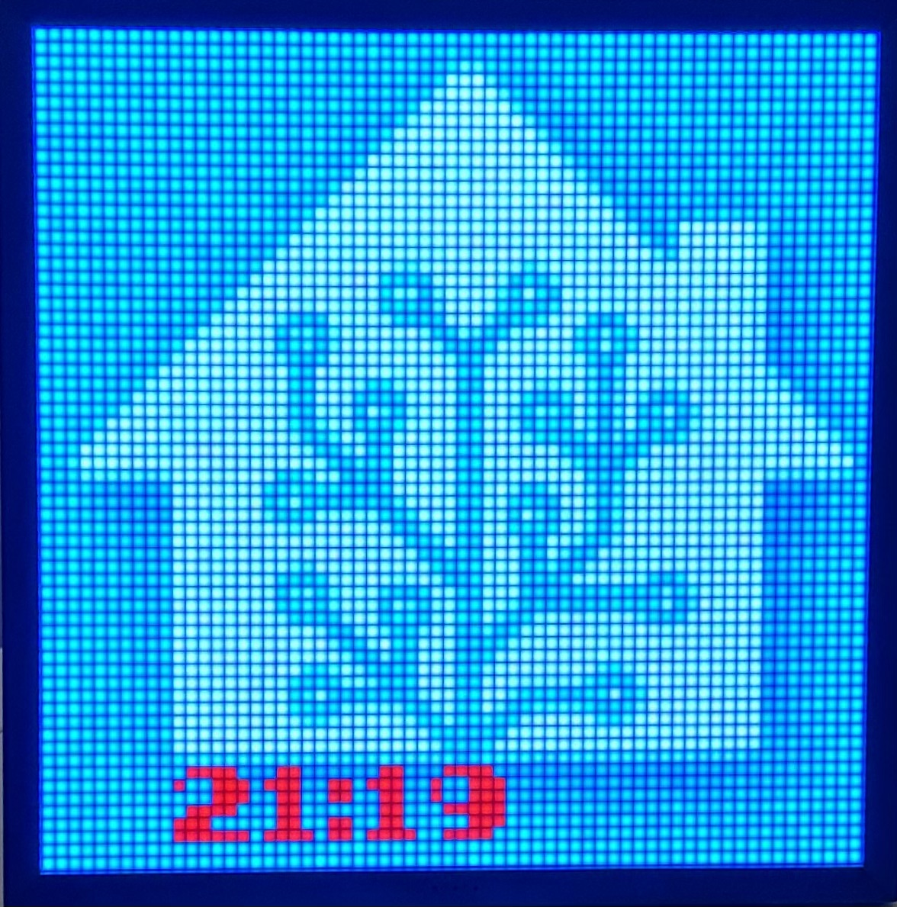

# Divoom Pixoo 64 Home Assistant Integration

[](https://github.com/custom-components/hacs)
[](https://www.buymeacoffee.com/gickowtf)


Custom component for easy use of a Pixoo64 within Home Assistant

## Installation
1. Install this integration with HACS (adding repository required), or copy the contents of this
repository into the `custom_components/random_entity` directory.
2. Restart Home Assistant.

Now edit your configuration.yaml


### configuration.yaml example:
 Just a small example with the HA logo and the current time!


```
sensor:
  - platform: divoom_pixoo
    ip_address: 'CHANGEME'
    scan_interval: 10 #All 10 seconds the Display is get an update
    pages:
      - page: 1
        texts:
          - text: 'sensor.time' #Currently, only the status of a sensor is possible or a free text combined with the status
            position: [10, 56]
            font: FONT_GICKO # at this time there are two different Fonts FONT_GICKO and FONT_PICO_8
            font_color: [255, 0, 0] #red in RGB
        images:
          - image: "/config/img/testimage.png"
            position: [0, 0]
```

### all options for configuration.yaml

| **options**    | **settings**                                                                               |
|:---------------|:-------------------------------------------------------------------------------------------|
| ip_address     | the IP address of Pixoo64 required                                                         |
| scan_interval  | to update the display or the time in seconds to jump from page to next page                |
| pages          | required                                                                                   |
| page           | required numbered by integers                                                              |
| texts          | required                                                                                   |
| text           | Currently, only the status of a sensor is possible or a free text combined with the status |
| position       | The text position on a XY axis at 64x64 pixel                                              |
| font           | at this time there are two different Fonts FONT_GICKO and FONT_PICO_8                      |
| font_color     | RGB colors                                                                                 |
| images         | not required                                                                               |
| image          | Path to the image including file name .png preferred                                       |
| position       | The text position on a XY axis at 64x64 pixel                                              |
If you have any further questions, I will be happy to help.

## Planned updates

If you are interested in helping with the project I would love to hear from you.

- async
- Push notification
- many more examples

## Discussions

I would be happy if you present your configuration.yaml in the Discussions area  
https://github.com/gickowtf/pixoo-homeassistant/discussions