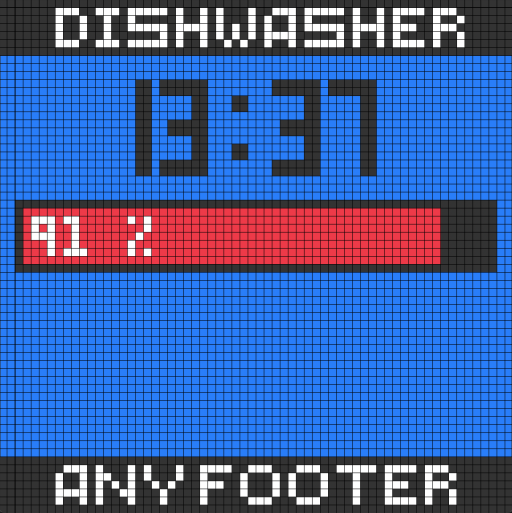

# Progressbar
Here you can see an example of the progressbar completely in YAML code. At the beginning you have the variables 'header', 'time', 'percent', 'footer' and 'icon' in base64 all variables can be populated with templates. For example 'header: "{{ 'states(sensor.YOURS)' }}"...

For the image in base64 format I used this page [here](https://base64.guru/converter/encode/image).


```yaml
- page_type: components
  variables:
    header: "{{ 'dishwasher' }}"
    time: "{{ now().strftime('%H:%M') }}"
    percent: "{{ states('sensor.example') }}" 
    footer: "{{ 'Any footer' }}"
    # icon in base64
    icon: "{{ 'iVBORw0KGgoAAAANSUhEUgAAACAAAAAgCAYAAABzenr0AAAACXBIWXMAAADsAAAA7AF5KHG9AAAAGXRFWHRTb2Z0d2FyZQB3d3cuaW5rc2NhcGUub3Jnm+48GgAAB+9JREFUWIW1l2lUVOcZx393ZpiBYWdGFodFFJdg1ZAqrrEmnsZ6NJq2pG20Ku5VY2zTRI2pR3Ma7dEPmrTuxH03eqrBnMSgUUCLIMrgQFBE3AIICgzODDDLvW8/oAIO6kna/M+5H+a9//d9/s9yn3leaIUKjWYRvn41gPhJHv8AK35+iwHVI6PSY/O+vmlEmCbwzt/0dEkAlZpnQpYh/xwIAQOGgfo5fLcbzp6Aw7sVbNbd2GypbQX0Rud7kb3f6D7ul8D4MD1zy2uJ9lHzYUzI4zM8AlKuVlPW5MZv6QxMNZfALVMX9xJ1y7bT3c+Hwz0jULe6xcd3rFS6PKzvZuTofTtLd+yENX+XcTb3Bb7TPOT1p0dvFyFhuk8rGzh83853TW4KJIkrTe42AgTlzW6w1uG6kEehWeC5oyN0TD5Y67guhfHH0ho0UquCa81uXEIwqbSGCpcM4VEQFw+lJf3bCtDhH6gCuOeWueeWAXAhKHA4vcMZGIwmQE/aXgc4ZPwCtTgCAlEEWBpdHWbA7Hi4rtaAzk8CfAE0HbKfB7Ua5/KNrNi2DEkoOJYtB43PjzrKW8DdCqTjh5AarM/dXGtKAkCVkQ4Z6R1yJCGQFBk5xIAY9/vnCGhqRD1/At269SQwOMSL/GPhbHRw78plak/8G8/S1c8QUFaCr86XIaPf4GaJBVt9LSq1mtgevQkMNVB3t4LKG2UIoWCIiqZzfHcAKstLqb1bgSSp6ByfQFikCVt9LbdLi1FkGaMplmBjOLbsk3i+v9XOpKrdL7cLtcaHKxfPk33mNGbRiQKbhvSdm7DV1/Llrs2YXQGYhZFTxz6nsryUiutXOfXFYczCiNkVwJe7NmOrryV9x0YKbBrMohNnz5ym+vYNVCp1Sz94agQewt5gRSSPhymrEK4m5CkROBqsSP7BKPM+A0BtvYujwYpAoOqejDx7AwJQWU5jb6jH3WhHmrsFtH6InYtoLjvTYXpUHS2Gm2JQX8kGQJTmoTdGER7bBcVuhXu3QQiU0jyMplg6mWJRrp4HocD9OygOKxEx8eiNkYjSvBaxJdkEhYZ2KMArArLbhUarw3OzGC6fQpW1j9DQMOqrqwgyRvDg5FaEqSeSuxlZ9rRs8jgR2QeRvi8hyBhBfU0VoaFhNJ/ZhaJ48NwqRhU1DNnj8RLwqGXNYtCINfxmor+0ZC7qMGOL96iQHv+X8HitZaPS7qCO1yUEEhIKsuxBNNTD7L9CVoaC5dIcYItXBFTRcXjW7uowXP8TLucgbV7bxpUWeKfgZhn8esj/XwB4Ge9QQFB0F0aO+x3ZR3YxKDmZt+fNJSkpCa1Wy2VLEbv27ePwgQMMHJNC5649gJY+kHP8EDOmTWfChLdISEjA5XKRde4/pKWlUWguJCaxH1cK8rA/RdwsBo2wszpN6A3hwtApQmzatEmUlZWJKdNnisiuPUVgRLQY+toYcerb0+LQsePCYDSKsdPfEWOmzRdhBqPIzc0VmZmZ4tXRY0VIVIwwxHUXE6bOFIVFxeKjlauEwdhJ+AYECeYtEvR5SQZmQQefYWNtDePHjSU5OZmkAcl8fsdDTep6HHO2k+OJZtSY17lfVcEHyz7CfOo4lzK+YOOG9RQVFTFqzOtkGQbyYMEB6lNWcqCgksFDX2bIkMGM/OVrNNsfPDU9jyMAiJKSEjHslZFCN36BUB20tz5bK4UqZYXQBQSJHLNFxMTGiZi4OFFdXS30gUFCWnK0HV+9tkSokt8U/YePFMdPnmn5nJ6IgHcNhIRSVVXFucwz8P6fkMoL2hNCI3Grffk6/Rhd4uPRaX3Ys2cPsm8QUqAB2vCF2w0xfbl4dDl1tXMIDgmh4Ql7XgKaHHZSU1MRigw7FnpXrssFjQ2s+/QTnE4nKkmi0GzG1WBHfDK5PVcIcDlBlln87gIcdu8S9BLgo9NhsViIjI7BuWAHdPt560tFQSrMRfwrhQ1pW9m8fh1aHx8WLXyfX72RgnvtJVC3DiaS3YbIPILmyBLSM07z8oAknuyF3kVot5OTk8P01FT0exaC09H6sroScWozXeLiiI6LJ/d8DmfPZpOYmEh8jAnNgWUtXj/y/lYpfLuRKVMmk5+XS6PD8aQ57whIksTCxR/wzddfca18Jll/6Yer/zgUj0BVkkWETmHbnp1sXvdPuv3sRTwemRUr/8HBvbsZ/9s3ub80C0eP4Uj1NVCUwS+GDGbm7DlMnfgHaDOsPlVAoCmWJhkmTprEjm3bKC4uJjMrmwa7g4GTlzD81ZGsWrWajBMnGPHWDIQQ7N+3Bb3ej4u5OaSnp5N3yUxwYDdGLJtKWERn3l3wNvZmJwGhBq9G5JUCd1MjUQkvkF9QSM9eL7B//wGiTZ3pk9iLnLwLDBs8mO2fbaFLvwFU3Sjj7s3rJCQNYs2atfTt9yIWSxFJfXoT3imcrTt2MmLoICxFxfgFG/C4vCdsrwg0NzWSU34NTHEA7DcXc9RSglYCm6wgGyLBEEl+xZ32G3v1oQZYdzIT/9PZSBLYPAoiIREXcMNah8vjftLcYwFOHDYFfQDCzx/39D+3G7M7nvSfDm8/FbBcgH1bQauF5iaA5rYC8ikt1hIeBSNGwaoloMg/0OwzIERLAb4yGnRauH1DABeg3eVUv4XwyInM/1BP1x7Pv5z+ULjdkP0VHN6jYG/Yic027UmKCo3mPXz97vLTXc/r0eneo03x/xfiSa5nAaLzsQAAAABJRU5ErkJggg==' }}"
  components:
  - type: rectangle
    position: [0,0]
    size: [64, 64]
    color: [0, 123, 255]
  - type: rectangle
    position: [0, 0]
    size: [64, 7]
    color: [51, 51, 51]
  - type: rectangle
    position: [0, 57]
    size: [64, 10]
    color: [51, 51, 51]
  - type: text
    content: "{{ header }}"
    color: white
    font: FIVE_PIX
    position: [5, 1]
  - type: text
    content: "{{ time }}"
    color: [51, 51, 51]
    font: CLOCK
    position: [15, 10]
  - type: rectangle
    position: [2, 25]
    size: [60, 9]
    color: [51, 51, 51]
  - type: rectangle
    position: [3, 26]
    size: ["{{ 58/100 * percent | int }}", 7]
    color: red
  - type: text
    content: "{{ percent }}%"
    color: white
    font: PICO_8
    position: [5, 27]
  - type: text
    content: "{{ footer }}"
    color: white
    font: FIVE_PIX
    position: [5, 58]
  - type: image
    position: [22, 35]
    image_data: "{{ icon }}"
    resample_mode: box
    height: 20
```
